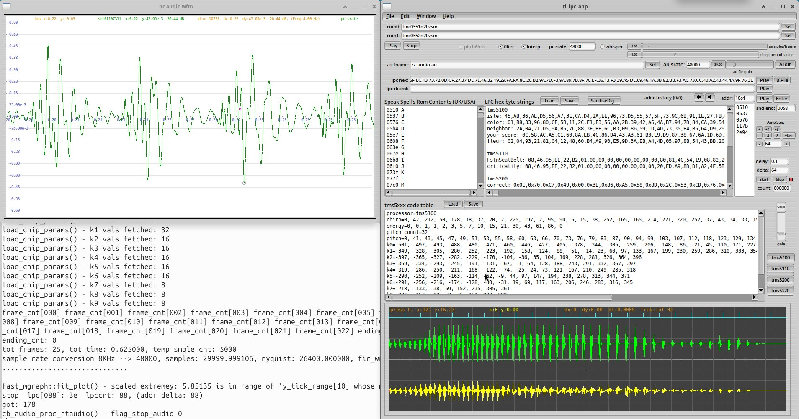

Mar 2026 v1.09

## ti_lpc
Texas Instrument Speak & Spell synthesizer, renders rom sounds/vocal hex strings to PC sound hardware/sound files. 

## Intro
The Speak & Spell developed in the late 1970s made use of a TMS5100 digital signal processor chip (DSP) for speech decoding. Briefly, the chip contained glottal chirp sound source(vowels), white noise source(consonants,etc), an adjustable lattice filter and a D/A converter. The chip was an amazing engineering achievement at that time. The speech encoding made use of linear prediction coding (LPC) which greatly reduced data rates and therefore chip count, this allowed cost effective mass production. The audio encoding was done at the factory and stored in seperate roms as bit strings. It is these rom bit strings which were read by the above mentioned chip that controlled its elements and produced fluid sound articulation. One or two 16KB 8 bit roms were required to hold enough speech to make a clever useful educational tool. The bit strings which I call lpc strings below (hex byte strings), are segmented into frames, they contain which audio source to use, its period (i.e. the pitch if a glottal source), amplitude gain, and filter coefficients.

The TMS5100 (aka TMC0280) evolved over the next few years with improvements in speech quality, e.g: TMS5110, TMS5200, TMS5220. Some difference are the glottal waveform shape and code lookup tables used for filter coefficients among other things. These changes make for incompatibility, so vocal rom strings for one version of chip won't work well or at all with other versions. This app has tables for 4 chip numbers mentioned, so try all 4 for best sound. You can also make changes to the tables for other chip versions not included.


## How It Produces Speech
The chirp sound (a brief waveform sample) is looped using a variable period to produce the required pitch, this mimics a vocal chord stimulus (glottis). If a consonant or fricative etc is required, the chirp is replaced by white noise random number generator. Gain control is applied at this stage. The stimulus is then fed to a lattice filter which simulates the vocal tract. The lattice filter (via applied coefficients) effectively produces a signal which has freq resonances similar to what a vocal tract would impart. The resonances are known as formants (freq peaks), these produce vowel sounds when the chirp stimulus is used. The lattice filter will also shape the consonant/fricative stimulus changing its quality. The output of the lattice filter is then sent to the speaker via a digital to analogue converter and amplifier.


## Code
Some of the code is re-purposed from other projects I've tinkered with over the years, so excuse the antiquated c style, evolving conventions and inefficiencies.
Also note the code is not precise in sound reproduction to the hardware, but it sounds close enough.

Portions of this code come from the 'Speech library for Arduino' project:  https://github.com/going-digital/Talkie,
You will find many lpc strings in that project to try, they are within c code files, but this app will accept cut/pasted versions of them, use the 'SanitiseDlg' to help with this, it will remove: equal signs, braces, semicolons, etc, right click on the strings to see if they can be sounded correctly, then paste them in 'LPC hex byte strings' edit box if you want to make a collection for saving to file, see further details below.

The app makes use of information from MAME project and the toil of numerous archivists(hackers), visit the mame site to see some amazing preservation coding.</br>

Where pieces of code or ideas are originate from other people, the comments in source code will give links to who or where it came from.</br>


## Further Information
Some history:- https://www.vintagecomputing.com/index.php/archives/528/vcg-interview-richard-wiggins-talks-speak-spell</br>

Some hardware details:- http://furrtek.free.fr/index.php?a=speakandspell&ss=1&i=2</br>

Side note:- Votrax produced a phoneme based (as opposed to LPC based) sythesizer around the time of the TMS development, e.g. the SC-01, refer: https://en.wikipedia.org/wiki/Votrax</br> 


## Build
The code was developed with gcc on Ubuntu 20.04 64 bit, may work for Windows, but has not been tested some time.</br>
##### For gui version:
Requires: RTAudio v6.0.1, alsa/pulseaudio/jack, and FLTK libraries for linking, fltk-1.3.4-2 or better should work.</br>

_[**If you have RTAudio below v6.0.1**, you need to use alternate versions of: '**gc_rtaudio.cpp**' and '**gc_rtaudio.h**', alter makefile to point to these files: '**gc_rtaudio_v1.01.1.cpp**' and '**gc_rtaudio_v1.01.1.h**'

Uses fltk's fluid gui designer for layout of main window controls and some code is held within the fluid's 'fluid.fl' def file, fluid generated 'fluid.h' and 'fluid.cxx'.</br>

To build gui executable, type: make</br>

No installation is required.</br>

If it built without error, then run: './ti_lpc' from a folder where permissions for execution have been enabled, the app will read/create a 'ti_lpc.ini' settings file, and two '.au' audio files in same folder.</br>

##### For command line version:
The command line version is built by going into its folder and running make.


## Usage
##### For gui version:
Hover over controls to see a hint at what they do.</br>

Place Speak & Spell unzipped roms in a dir (Roms are optional, see below). Get them from a MAME rom site, e.g: snspell.zip. Then select their dir path with the 2 'Sel' buttons.</br>

Speak & Spell roms can come in pairs (see below regarding single roms), e.g:</br> 

USA rom0 file: tmc0351n2l.vsm</br> 
USA rom1 file: tmc0352n2l.vsm</br>

UK rom0 file: cd2303.vsm					//quick way to to hear difference is sounding the Z letter, Zed of UK, Zee for USA</br>
UK rom1 file: cd2304.vsm</br>


Note: Some units only had one Rom, these Roms are organised differently and their alphabet (if it was a Speak and Spell), various phrases and beep tone addresses are unknown, this code will not correctly show these roms. You will have to explore these roms using various controls provided to help map out addresses of where things are stored. There were other devices that used TMS5xxx series of chips, such as vehicle announcement systems.

(Roms are optional, if you have hex/decimal speech strings you can use them as is without roms).


The 4 buttons on the right labelled: 'tms5100', 'tms5110', 'tms5200', 'tms5220', each load predefined code tables into editbox 'tms5xxx code tables', try each of these if speech is corrupted or the wrong pitch. Note: there were other chips made that are not included, but you could try these by pasting in values, next to appropriate param labels:
If you have decimal values use param labels like: 'chirp=120, 255.....'
If you have hex values use labels like: 'chirp_hx=0xaf, 0x12.......'


The left editbox 'Rom Contents' will show all the letters, numbers phrases, beeps and words in the selected rom pair, and their rom hex address (only for Speak & Spell rom  pairs as these roms have a certain format and contain text that was shown on the unit's fluorescent display). The rom address itself needs to be right clicked on to make it sound (not the letter or word/sentence). 

The larger middle editbox 'LPC hex byte strings' holds handy scratch area for lpc hex byte strings (one hex string per line, use a colon if you want to prefix a text label, e.g: 'isle: 45,AB,36,....', 8 bit only, it can handle c code formatting e.g: 0x45,0xab.. is ok, these likewise can be right clicked to sound. Notice whenever you sound, the edit boxes 'lpc hex' has a hex string place in it. This is the last sounded string (possibly extracted from a rom depending on what editbox you right clicked it), you can play it again by hitting the Play button to the right, there is also the editbox 'lpc decml' which allows decimal strings to be entered, its also filled in when you click the Play for 'lpc hex' and visa versa.  

Speech roms exist for devices other than the Speak & Spell, these roms would still sound, but you will need the rom addresses where each vocal string resides.
You can enter rom address in the 'addr' edit box and hit enter. There is also some buttons to shift an address by a fixed amounts to help explore and find lpc string locations, if you don't know their addresses (hover over buttons for a brief description). You'll have to select which TMS chip version the roms are coded for using the 4 buttons on right, e.g: 'tms5200'. There is also an address auto stepping function. Be **aware** that the '**zz_cummulative.au**' sound file (described below) will grow large with auto stepping.

The app also generates a: '**zz_audio.au**' sound file after each sounding, the filename, samplerate and gain can be changed as req. Also generated is a: '**zz_cummulative.au**' sound file, always at 8KHz, it has all the soundings made since starting the app session.

Note: if you set an incorrect 'pc srate' (not matching your current pc's audio hardware samplerate) you will get pitch and duration errors (chipmunk/slo-mo).

Try setting incorrect 'pc srate' and change 'sample/frame' in conjunction with 'whisper' to get some interesting vocalisations.
Also, try copying a 'chirp=' string into another tmsxxxx chip code table to hear timbre of voice change

Long strings of speech (>20 secs of voicing) will take some time to render and be heard, it may appear the app has locked up, but if you ran app from a command line you will see it's probably still processing audio by the console output. Playing a string that was not meant to be fed into your currently selected tmsxxxx chip may also cause the appearence that the app is locked up.

Use 'AEdit' button to open your favourite audio editor, it runs a script/bat file and passes the saved .au audio filename you specified (or 'zz_audio.au'), edit the script or batch to call whatever audio app you prefer (script requires execution priveledges):
(linux) 'open_audio_editor.sh'</br>
(windows) 'open_audio_editor.bat'</br>


To open the 'help.txt' file from Help menu, edit script below:</br>
(linux) edit script file to call your favourite text editor (script requires execution priveledges): 'open_editor.sh'  (e.g: gedit $1 &)</br>
(windows) edit bat file to call your favourite text editor (script requires execution priveledges): 'open_editor.bat'  (e.g: notepad %1)


You can use an (antique) program called: QBoxPro (with DosBox running Windows 3.11) to create a tms5220 lpc compatible binary file from a wave file. For an excellent guide, refer: http://furrtek.free.fr/index.php?a=speakandspell&ss=9&i=2

Select a binary file to play using 'B.File' button.
##### For command line version:
For the command line version the run app 'ti_lpc_cmd' or 'ti_lpc_cmd.exe', use --help option or read the 'ti_lpc_cmd_help.txt' for usage examples.


## Graphs

The embedded graph shows various waveforms, cyan trace marks start of each speech frame, green is glottal pitch/white noise stimulus that feeds into lattice filter, yellow is rendered speech wfm (lattice filter o/p, 8KHz)


leftclick and drag to move trace on x-axis</br>
select a sample on a trace firstly (this also gives you keybrd focus),</br>

use mousewheel to change x scale.

press 'c' to zero y offset positions.</br>

press 'a' and spin mousewheel to change y amplitude, on a per trace basis</br>

press 'x' and spin mousewheel to change x position (or just drag), for all traces</br> 
press 'y' and spin mousewheel to change y position, on a per trace basis</br>


The second graph in its own window shows the samplerate converted speech wfm, this is at the samplerate you have entered for your current PC audio hardware.</br>
press 'h' for help on controlling this graph's trace.


##### Download audio file 'zz_audio.au' to hear a sample that this code produced.





```
//some strings for different chips, place them in 'LPC byte strings' editbox, anything before the colon such as labels (as shown below) are removed on playing the string (play by right clicking on a line)

tms5100
isle: 0x45,0xAB,0x36,0xAE,0xD5,0x56,0xA7,0x3E,0xCA,0xD4,0x2A,0xEE,0x96,0x73,0xD5,0x55,0x57,0x5F,0x73,0x9C,0x6B,0x91,0x1E,0x27,0xFB,0x04,0x9F,0x34,0xA3,0xC6,0xCE,0x89,0x29,0x9A,0xA5,0x5F,0xEC,0x13,0x73,0x72,0x0D,0xCF,0x27,0x37,0xDE,0x7E,0x46,0x32,0x19,0x29,0xFA,0xFA,0x8C,0x20,0xB2,0x9A,0x7D,0xF3,0x9A,0x89,0x7B,0x8F,0x70,0xEF,0x36,0x13,0xF3,0x39,0xA5,0xDE,0x69,0x46,0x1A,0x3B,0x82,0xBB,0xF3,0xAC,0x73,0xCC,0x40,0xA2,0x43,0x44,0x4A,0x9F,0x76,0x3E,0x00,0x00,0x95
color: 0x01,0xB8,0x33,0x96,0x80,0xCF,0x5B,0x11,0x2C,0xE1,0xF3,0x56,0xAA,0x2B,0x39,0x42,0xA6,0x4A,0xB7,0x94,0x7D,0x84,0xCA,0x39,0x54,0x5D,0xE7,0xCA,0xA5,0x64,0xAF,0xA2,0xEC,0x34,0xC3,0x4A,0x57,0x2B,0xDC,0x71,0x47,0x54,0x36,0xC7,0xA0,0x6A,0x9F,0xAC,0x6A,0x99,0xE6,0xC4,0x3A,0xC5,0xF8,0x36,0xA9,0x6A,0x78,0xBA,0xB5,0x65,0xD2,0x95,0xF1,0xF6,0x31,0xDC,0x15,0x5D,0xC9,0x45,0x73,0xEC,0x39,0x67,0x5F,0x7E,0xE9,0xF5,0x88,0x12,0x0B,0x44,0xB5,0x19 
neighbor:  0x2A,0x0A,0x21,0xD5,0x9A,0xB5,0x7C,0x88,0x3E,0xBB,0x6C,0xB3,0x09,0x86,0x59,0x1D,0xAD,0x73,0x35,0xB4,0xB5,0x6A,0xD9,0x29,0xF4,0xAA,0xA5,0x9C,0x24,0x9B,0x0E,0x41,0x57,0x6D,0xBD,0xB4,0xD3,0xA8,0x33,0x69,0x78,0xEA,0x6E,0x44,0xE0,0x34,0xA3,0x24,0xB3,0xB2,0xA4,0x3A,0xC5,0x5A,0x74,0xE4,0x25,0x86,0x9E,0x5A,0xB6,0x97,0x6D,0xCC,0xD6,0xCC,0xD2,0x4B,0xEB,0xF6,0xB1,0xB5,0x5B,0x9F,0x3A,0xEB,0xAA,0x37,0xDF,0xB4,0xDD,0x0B,0xC9,0x94,0x6E,0xEA,0xBA,0x67,0x5A,0x29,0x6B,0x1E
your score: 0x0C,0x58,0xAC,0xA5,0xC1,0x60,0x8A,0xEB,0x4C,0x86,0xD4,0x43,0xA3,0x61,0xB3,0xE9,0xD9,0x87,0x38,0x67,0x6A,0x1D,0x6D,0x2E,0x3E,0xC8,0x06,0x57,0x5D,0x6B,0xB2,0x90,0x8E,0x66,0xFA,0x92,0x76,0x60,0x33,0xC4,0x6C,0x25,0xED,0x22,0x6E,0xAB,0x73,0x4A,0xBE,0x43,0x43,0xB4,0xA0,0x88,0xA6,0x87,0x25,0xEB,0x26,0x91,0x8B,0x0F,0xCF,0xC6,0xD4,0x2C,0x6F,0x5D,0x31,0x44,0xC4,0xEA,0xD9,0x59,0x73,0x88,0x55,0x5C,0xD0,0xCA,0x5B,0x02,0x73,0xB5,0x27,0x30,0xFA,0xB8,0x07,0x43,0x6B,0xEF,0x1A,0x6D,0x6D,0x9B,0x91,0xC3,0x35,0x43,0xBA,0x2C,0xA3,0x63,0x9A,0x37,0xA7,0xD9,0xB6,0xBB,0xE6,0x9C,0x74,0x77,0xCB,0x58,0x01,0x8C,0x51,0x11,0xC0,0x79,0x15,0x09,0xCC,0xD7,0x19,0x01,0x06,0x02,0x04,0x37,0xD3,0xBC,0x96,0x15,0x16,0xEA,0xB7,0x45,0xBE,0xDD,0x5D,0xAA,0x51,0x2B,0x7C,0x66,0x98,0x66,0xA7,0xD6,0x95,0xEE,0x09,0x55,0x7F,0x6D,0x88,0x3C,0x69,0x66,0x79,0xEA,0xE8,0xA3,0x4D,0xDD,0x4A,0xCB,0xAC,0x6F,0x5A,0xBA,0xB9,0x4E,0xDB,0x5E,0xBF,0xF4,0x42,0x20,0x8C,0x56,0x04,0x5C,0x33,0xC5,0xE0,0x01
fleur: 0x02,0x04,0x93,0x21,0x81,0x04,0x12,0x48,0x60,0xB4,0xA9,0x90,0xE5,0x9D,0x3A,0xEB,0xA4,0x4D,0x05,0x97,0x8B,0x54,0x43,0xBB,0x20,0x89,0x55,0x95,0xB7,0xD9,0xE6,0xDA,0xE1,0x75,0xD1,0xC8,0x9A,0xD0,0x33,0xCE,0x5C,0x4B,0x6A,0xB2,0x7A,0x64,0x67,0xA8,0xDC,0xD3,0x32,0x31,0xC2,0x22,0x63,0xE6,0x65,0xA6,0x5A,0x21,0x5E,0x65,0xE9,0x01


tms5110
FstnSeatBelt: 0x08,0x46,0x95,0xEE,0x22,0xB2,0x01,0x00,0x00,0x00,0x00,0x00,0x00,0x00,0x00,0x80,0x81,0x4C,0x54,0x19,0x08,0x82,0x2C,0xE5,0xC8,0xA2,0x9D,0x22,0x4D,0x8B,0xD5,0x9A,0xAB,0xDA,0x93,0x11,0x7B,0x16,0x11,0xB5,0x25,0x23,0x8C,0x6C,0x44,0x19,0x4F,0x7A,0x68,0xA1,0x5B,0x66,0xAB,0x7C,0xD2,0x43,0x09,0x93,0x9B,0xB2,0x79,0x1F,0x03,0x36,0x23,0x53,0xE0,0x17,0x51,0x06,0x5E,0x2F,0x23,0x60,0xF7,0x54,0x06,0x9A,0x4C,0x13,0x60,0xA8,0x54,0x06,0x72,0x48,0x19,0xA5,0xEA,0x76,0x69,0xF9,0xBC,0x46,0x35,0x6D,0xDA,0xF6,0x78,0xCD,0x6A,0x5B,0xAD,0xEC,0xF1,0x9A,0x4D,0xB7,0x5A,0xD9,0xEB,0x35,0x6B,0x08,0x0B,0x89,0xC5,0x6D,0x56,0x15,0x11,0x6E,0xA9,0x14,0x78,0x59,0x49,0x80,0x5F,0x42,0x05,0xF8,0xA5,0x55,0x81,0x17,0x58,0x5B,0xAC,0x32,0x54,0xC2,0x17,0xAE,0x56,0xB5,0x9B,0x9A,0xDF,0x1A,0xAD,0x6A,0x75,0x33,0x9B,0x55,0x6A,0x37,0xE8,0x19,0x6E,0xAF,0xD4,0x6E,0xD0,0x23,0xCC,0x5E,0xA9,0x55,0x62,0x79,0x98,0xD3,0x54,0xA3,0xE4,0x31,0x73,0x37,0xA9,0x15,0x41,0x69,0xED,0x76,0x62,0x2B,0xA3,0x47,0x21,0xEE,0x98,0x35,0x66,0xF7,0xCE,0xD8,0xBA,0xA6,0xCD,0xA4,0xD2,0x64,0xB8,0x4B,0x59,0xC1,0xB7,0xEA,0x50,0xD6,0xB2,0x42,0x6A,0xB1,0x21,0xBF,0x65,0xC7,0x52,0x98,0x83,0x79,0xCB,0xCE,0x71,0x50,0x97,0xF2,0x96,0x55,0xFD,0x32,0xAE,0xEA,0x4F,0xAB,0xC4,0x42,0x0B,0xEB,0xA6,0xC0,0x49,0xCC,0x02,0xFC,0x12,0x28,0xC0,0x2F,0x6D,0x02,0xFC,0xDE,0x22,0xC0,0xEF,0x25,0x02,0xFC,0xD6,0xAA,0xC0,0x0F,0x11,0x2D,0xAE,0x18,0x42,0xC6,0x4F,0x46,0x5C,0x39,0x19,0xDC,0xDE,0xB4,0xB8,0x82,0x21,0x4E,0x3D,0x71,0x71,0x68,0x42,0xBF,0x5A,0x84,0xE2,0xD0,0xA6,0xA1,0x2A,0x1B,0x80,0x81,0x22,0xD5,0x80,0x01,0x6A,0x23,0xD7,0xAC,0x3A,0x55,0x4B,0xB6,0xAC,0x55,0x74,0x99,0xB4,0xAD,0x5D,0xAB,0xD8,0x74,0x0F,0xDD,0xBA,0x4E,0x71,0x9D,0xEE,0xB2,0x75,0xDD,0xCA,0xAB,0x3D,0xB8,0x5B,0x79,0x59,0x4C,0x9B,0xF1,0xDE,0xF2,0x0B,0x9D,0x09,0x95,0xAC,0xE5,0x67,0x5E,0x13,0xC6,0xDD,0xD0,0x8F,0x2A,0xDD,0x45,0x64,0x03,0x00,0x03,0x3F,0x3B,0x31,0xF0,0x4B,0x1B,0x03,0xBF,0x04,0x33,0xF0,0x4B,0x0A,0x03,0xBF,0xA4,0x3E
criticality: 0x08,0x46,0x95,0xEE,0x22,0xB2,0x01,0x00,0x00,0x00,0x00,0x00,0x00,0x00,0x00,0x20,0xED,0xA9,0x8D,0xD1,0xA2,0x4F,0x5B,0x2D,0x19,0x4A,0x44,0x9F,0x31,0xB3,0x73,0xD5,0x92,0xCE,0x63,0x46,0x33,0x9A,0xA9,0xD9,0xC6,0x8C,0x61,0x25,0x92,0xFA,0x8E,0x99,0xD4,0x07,0x2D,0xE7,0x1B,0x33,0x8B,0x73,0x3A,0xF1,0x37,0x56,0x76,0x4B,0xBE,0x9C,0x6F,0x9C,0x52,0x9D,0x2A,0xAD,0x17,0x3D,0x6C,0x77,0x6F,0x1C,0x51,0x75,0xE2,0x6E,0xBD,0x1B,0x67,0xEF,0x5C,0xB2,0x6A,0x97,0x2E,0xD5,0x35,0xEB,0x94,0x6E,0x82,0xBD,0x72,0xD6,0xC9,0xC3,0x94,0x68,0xF8,0xAC,0x95,0xBA,0x56,0x49,0xB3,0x3A,0x2B,0x76,0xCD,0x3C,0xA1,0xD6,0x5A,0x6C,0x1A,0x62,0x3C,0x94,0x86,0x14,0x05,0xAE,0x5B,0x25,0x0E,0xA9,0x4B,0x54,0x4B,0x4F,0xEC,0xC0,0x0A,0xA1,0xAD,0xCC,0xDE,0xA1,0x42,0x4C,0x47,0x6E,0xD1,0x98,0x22,0x3A,0xAF,0x58,0x8D,0x9A,0x66,0x2E,0x5E,0xA9,0x3B,0x71,0x55,0xDD,0x52,0x72,0x55,0x30,0x69,0xEE,0xB6,0xE5,0xAA,0xA0,0xCA,0xCD,0x59,0xCB,0x55,0x61,0x65,0x98,0xD3,0x9E,0x57,0x6E,0x86,0xD3,0xD9,0xDB,0x8E,0x99,0x59,0x67,0x84,0x74,0x76,0xD9,0x8D,0x0A,0xB1,0xBA,0xED,0x72,0xA8,0xD3,0xCA,0xBC,0x28,0x1D,0x17,0xAF,0x8C,0x2D,0x4B,0x6B,0x3E,0x5C,0xB9,0x68,0xD6,0x55,0x82,0x9F,0x76,0xA3,0x3C,0x2B,0xC5,0x52,0x6E,0xAE,0xAB,0x57,0x4C,0x31,0x24,0xCA,0x16,0xAF,0x58,0x43,0x88,0xA7,0x2E,0x5E,0xA9,0xF9,0x60,0x4B,0x5D,0xBD,0x72,0xD5,0x2D,0x5A,0xDE,0x66,0x95,0x2A,0x2B,0xCA,0xA9,0xCB,0xA8,0x8D,0x79,0x4D,0x90,0xFB,0x51,0x1B,0xB3,0x1E,0x47,0xF7,0xA3,0x15,0xA9,0xD3,0x4A,0xCE,0xDD,0xF0,0xB1,0xC2,0xD5,0xAC,0xA0,0x15,0x55,0xBA,0x8B,0xC8,0x06,0x10,0x20,0xDA,0xD0,0x94,0x4B,0x28,0x77,0x77,0xC7,0xAD,0xA5,0xC1,0xAD,0x29,0xB9,0xD7,0x4C,0x35,0xDC,0xDC,0xB3,0x9D,0x59,0x4D,0x8B,0x96,0xF5,0x5D,0xB3,0xFA,0xA0,0xA8,0xE8,0x5C,0x66,0x0B,0xC6,0x12,0x91,0x49,0x81,0xDD,0xDA,0x04,0xD8,0x7D,0x4B,0x80,0x59,0xB6,0x0C,0x18,0x79,0xAB,0xD5,0x9A,0x9C,0x34,0x34,0x4B,0x6B,0xC5,0x2E,0xC3,0x84,0xFA,0xD6,0x73,0x1A,0xC4,0x35,0xF5,0xA5,0xE7,0x96,0xA0,0x23,0xDE,0x4B,0xCF,0xC3,0xD1,0x4B,0xB2,0x97,0x56,0x7B,0xA0,0xA5,0xE4,0x43,0x2B,0xAA,0x74,0x17,0x91,0x0D,0x00,0x64,0x35,0xA9,0x1A,0x11,0x6D,0xC6,0x1E,0xC6,0xD1,0xA2,0x17,0x8F,0x36,0x5C,0xA0,0x46,0x3D,0x5E,0xAD,0x47,0x15,0x95,0x5E,0xB2,0x5A,0xB3,0x2A,0x26,0xB9,0xB8,0xF5,0xA6,0x5D,0x8D,0xFD,0x55,0x19,0x87,0x9B,0xAB,0x72,0x7E,0x05,0x16,0x42,0x63,0xE0,0x45,0x04,0x0A,0x00,0x18,0x08,0xAD,0x5D,0x80,0xD8,0x3B,0x15,0x48,0xA5,0x2C,0x85,0x1C,0x27,0xC4,0xD4,0xCB,0x8A,0xD9,0x87,0x6A,0xCB,0xDA,0x15,0x9B,0x2B,0xE7,0x94,0xB5,0x23,0x55,0xEF,0xA1,0xA6,0x6B,0x14,0x68,0x9C,0x63,0xB5,0xEA,0x53,0xCD,0xF4,0xCD,0x9A,0x25,0x28,0x47,0xC6,0xE2,0x36,0x5B,0x73,0x34,0xB3,0xCD,0x68,0x46,0x95,0xEE,0x22,0xB2,0x41,0x80,0xEA,0x2E,0x04,0xC8,0x79,0x24,0xF5,0x50,0xC6,0xC4,0xBC,0x65,0x9B,0xD1,0x76,0xAB,0x4A,0x9B,0xB2,0xA3,0x9E,0x09,0xE5,0x6D,0xE9,0x46,0x5B,0xA3,0xA2,0x6B,0xC2,0xF3,0xA9,0x9B,0xC5,0xB7,0xB8,0x1F,0x7C,0x8F,0x89,0xAE,0x76,0x3F,0xE9,0x1A,0x57,0xC9,0x62,0x5E,0x52,0xDD,0x26,0x92,0x16,0xC1,0x22,0xCA,0x5D,0x44,0x36,0x00,0x00,0x00,0x00,0x00,0x00,0x00,0x00,0x00,0xB8,0xD1,0xBD,0x71,0x44,0xD5,0x69,0xBD,0x1B,0x67,0xEF,0x5C,0xB2,0x6A,0x97,0x2E,0xD5,0x35,0x6B,0x95,0x6E,0x82,0xBD,0x72,0xD6,0xCA,0xC3,0x94,0x68,0xF8,0xAC,0x95,0xBA,0x56,0x49,0xB3,0x3A,0x2B,0x76,0xCD,0x3C,0xA1,0xD6,0x5A,0x6C,0x1A,0x62,0x3C,0x94,0x86,0x14,0x05,0xAE,0x5B,0x25,0x0E,0xA9,0x4B,0x54,0x4B,0x4F,0xEC,0xC0,0x0A,0xA1,0xAD,0xCC,0xDE,0xA1,0x42,0x4C,0x47,0x6A,0xD1,0x98,0x22,0x3A,0xAF,0xD8,0xAD,0x1B,0x85,0xEE,0x3B,0x71,0x68,0x55,0x49,0xDD,0x5A,0x62,0x55,0x58,0x69,0xDE,0xA4,0xC5,0xA6,0x31,0x2A,0x34,0x59,0x0B,0x4D,0xA3,0x57,0x68,0xB2,0x12,0xAA,0xC2,0xE8,0xB4,0x64,0x21,0x66,0x81,0x9D,0x1A,0x4D,0x50,0x14,0xC1,0x5D,0x44,0x64,0x03,0x08,0x90,0x98,0xDB,0xE8,0x4B,0x47,0x30,0x6B,0x9E,0x53,0x9B,0x0E,0xE5,0xF4,0xB5,0xA7,0x34,0x97,0xA2,0x15,0x6B,0x4E,0x69,0xB1,0x54,0xC3,0xD7,0xAC,0x5A,0x63,0xAA,0x97,0x2F,0x5E,0xAD,0xC6,0x50,0x4F,0x5F,0xBC,0x7A,0xF5,0xA9,0x5E,0xB6,0xBA,0x8C,0x6C,0x43,0x4A,0xC9,0x69,0x9A,0xC9,0x18,0xB7,0x48,0xD2,0xB6,0x4A,0x12,0x0B,0x95,0x4E,0x6B,0xD5,0xE8,0xE2,0xE1,0xBB,0xD6,0xAA,0xDE,0xC9,0x33,0x76,0xAD,0xD5,0x7C,0x90,0x79,0xEE,0x1A,0xB3,0x39,0x27,0xF7,0xDE,0xD8,0x46,0xF7,0xCE,0x8E,0xD3,0x0B,0x8D,0xA8,0xD2,0x5D,0x44,0x36,0x98,0x51,0x24,0x7A,0x69,0xD5,0x0A,0x73,0xE7,0x36,0x62,0x93,0x63,0xC0,0x0A,0x2E,0x1A,0x70,0x00,0x00,0x60,0xB6,0x57,0x9A,0x61,0x25,0xD7,0xED,0x60,0xD4,0xD3,0xDD,0x69,0x5A,0x49,0x8B,0xA5,0xBB,0xB3,0x35,0x4B,0x30,0x73,0xD3,0x36,0xAB,0x37,0x1F,0xAA,0x61,0x7B,0x4E,0xEB,0x36,0x44,0x3B,0x37,0xAF,0x3A,0x7C,0xB2,0x64,0xAC,0x5E,0x65,0xF8,0x20,0xA9,0x5C,0xBD,0xCA,0x88,0x41,0x12,0xB1,0x7A,0xE5,0x9E,0x4C,0xD4,0x7C,0xF1,0xCA,0x35,0x9B,0x98,0xF9,0xAA,0x95,0x4B,0x0C,0xF6,0xF0,0x4E,0x2D,0x55,0xB3,0xAC,0xCE,0xB9,0x51,0x8A,0x2A,0xDD,0x45,0x64,0x03,0x08,0x90,0xBA,0xA3,0x02,0x79,0xA5,0x08,0x90,0xA6,0xF3,0xC8,0x29,0x26,0x45,0x51,0xD6,0x51,0x52,0x53,0xAE,0xA6,0xBC,0xA3,0xA7,0xE6,0x1C,0x43,0x79,0xDB,0x48,0xC5,0x29,0x87,0xFA,0x94,0x99,0xB2,0x51,0x37,0xED,0x2A,0x3B,0x87,0x24,0x5B,0xDC,0x5B,0x6E,0x09,0xCD,0xBC,0xEC,0x2D,0xBC,0xEA,0x86,0xF1,0x38,0x9F,0xFB,0x25,0x0C,0xE3,0x4B,0x3E,0xF7,0x6B,0x58,0x81,0xE5,0x78,0x0F


tms5200
correct: 0x0E,0x70,0xC7,0x49,0x00,0x3E,0x86,0xA5,0x58,0x8D,0x2C,0x53,0xCD,0x76,0x8B,0x56,0x98,0x23,0x95,0xA2,0x99,0x6B,0x95,0x9B,0xDA,0xAC,0xCA,0x27,0x6D,0xF1,0x8D,0xBD,0xAB,0x59,0xF7,0x26,0xB5,0xBE,0x73,0x79,0x4D,0x90,0xDC,0xB9,0x21,0x0C,0x28,0x8F,0x91,0x29,0x47,0x00,0x00,0x01,0x0C,0xED,0xAA,0x80,0xE5,0xA2,0x05,0xD0,0x74,0x3B,0x02,0xBC,0x4B,0x7A,0x00,0x00
what's that: 0x00,0xA9,0x62,0xAD,0x1F,0x38,0x3A,0x9F,0x4A,0x87,0x7C,0x12,0x6D,0x73,0x2A,0xE7,0xE3,0x4D,0x3D,0xF5,0x29,0x6C,0xCF,0x64,0xAF,0xC4,0x37,0x6F,0x55,0xD0,0x69,0x92,0xEA,0x24,0x00,0x59,0x85,0x1B,0x20,0x84,0x34,0x06,0xF8,0xEC,0x82,0x00,0xED,0xCC,0x52,0xC1,0x6A,0x46,0x6A,0x26,0x3E,0x75,0x54,0x99,0x62,0xD2,0x7D,0x34,0x45,0x44,0xB1,0x72,0x7E,0x07,0x68,0x5C,0xE3,0x00,0x0F,0x6C,0x0D,0x50,0x00,0x19,0x01,0x34,0x71,0x76,0x45,0x8B,0x13,0x66,0x22,0x77,0x54,0xDE,0xBB,0xAB,0xF2,0xEA,0x53,0xF9,0x10,0x61,0x6A,0x6F,0x4E,0xE5,0x9A,0x87,0xC6,0x4C,0x39,0x45,0x8C,0x65,0x66,0xFE,0x78,0x65,0x3E,0xA7,0x7A,0x44,0xE9,0x95,0x85,0x5C,0xEA,0x1E,0x95,0x47,0x11,0x4B,0x99,0x69,0x4C,0x01,0x07,0x0C,0x13,0xA1,0x81,0x07,0x00,0x00
ready start: 0xAE,0x91,0x85,0xD3,0x32,0xB8,0xB5,0xC6,0x35,0x4E,0x09,0xCA,0x7E,0x6A,0xDF,0xB9,0xCC,0xB4,0xFB,0xA9,0xE2,0xD4,0x30,0xD5,0xEE,0xB7,0x5A,0x55,0xEA,0x5A,0x10,0x99,0xA5,0x55,0x31,0x1B,0x1B,0x4E,0xA6,0x55,0xE5,0xAE,0xCA,0xD2,0x9D,0x5A,0x55,0xA6,0x08,0x49,0x2D,0x8D,0xB5,0x6C,0x11,0xB0,0x54,0x9A,0x06,0x0C,0xB0,0x8C,0x45,0x29,0xBC,0x4A,0x53,0xCB,0x4E,0xA5,0xA9,0xC2,0x4C,0xD5,0xF2,0x1A,0xA0,0x03,0x35,0x05,0xFC,0xA9,0x6C,0x01,0x05,0xFC,0x1D,0x0C,0x10,0x80,0xA6,0xD2,0x4F,0x1E,0x43,0x44,0x86,0xB4,0xBD,0xC5,0xAD,0x4E,0xE5,0x8B,0x77,0x18,0x37,0x59,0x85,0x9F,0xE6,0xA5,0xBA,0x78,0x67,0x33,0x6D,0x91,0x9F,0x22,0x1D,0xE6,0xD0,0x45,0xDA,0x49,0x46,0xB8,0x2C,0x00,0x03,0x64,0x19,0xCA,0x80,0x26,0x9B,0x11,0xE0,0x12,0x33,0x00,0xC0,0x03,0x00,0x00
cassette: 0x0E,0xF0,0x25,0x48,0x03,0x1A,0x68,0xB9,0x49,0xCD,0xE1,0x1D,0xAB,0x56,0x06,0x58,0xD6,0xCD,0x02,0x16,0x70,0xC0,0xB7,0x19,0x16,0x90,0x40,0xAB,0xDC,0x30,0xF7,0xE8,0xBA,0xBB,0xDE,0xF5,0x6C,0x46,0xED,0x9A,0x85,0x79,0xC7,0xA9,0x95,0xAC,0x40,0x03,0x1E,0x20,0x80,0x54,0xA9,0x18,0x78


tms5220
automatic: 0x6B,0xAC,0xA4,0xA7,0x82,0xFD,0xDD,0xF1,0x0E,0x67,0x68,0xB2,0xA2,0x83,0x72,0x1B,0xA0,0x52,0x65,0x03,0xFC,0x24,0x3A,0xEA,0xAD,0xCD,0xD5,0x4C,0xDB,0xA9,0xAB,0x76,0x4B,0x93,0x2D,0x67,0x28,0xA2,0xCC,0xC2,0xF3,0x8C,0x21,0x2B,0xD7,0x70,0xC9,0xD8,0x86,0x4A,0x8D,0xC6,0x35,0x49,0xE9,0x8B,0x54,0x29,0x76,0x37,0x63,0xC8,0xCE,0xDD,0x54,0x6A,0x9D,0xBA,0xC6,0xD2,0xD2,0x58,0x72,0xAB,0x5B,0xDE,0x72,0x35,0x35,0x5B,0x84,0x54,0x6D,0xD3,0xEE,0x90,0x11,0xEA,0x4E,0x5A,0x5B,0x53,0xAA,0xB3,0x2F,0xB9,0xD3,0x59,0xBB,0x6B,0xE5,0x94,0x35,0x7B,0x6F,0xE7,0x34,0xAD,0xD8,0xBA,0x17,0x81,0x22,0x94,0xBB,0x88,0x6C,0x00,0x03,0xB4,0x12,0x22,0x01,0x0E,0xFC,0x3F,0x62,0x13,0x7E,0x23,0x4C,0x22
inspector: 0x29,0xEB,0x5E,0xD9,0x32,0x27,0x9D,0x6E,0xFA,0x66,0x17,0x59,0x7D,0xDB,0xDB,0xB4,0xB6,0x7B,0xD0,0xCC,0x70,0xD2,0xDB,0xD6,0x0D,0xC7,0x38,0xAC,0x4D,0xD2,0xF0,0x0D,0xB3,0xA9,0xBB,0x73,0xC0,0x4F,0xE9,0x11,0xF0,0x80,0x02,0x86,0x52,0x01,0x03,0x44,0xEA,0x7A,0xA2,0x1A,0x43,0xD3,0x6C,0xF3,0x4D,0x6F,0xDA,0xB2,0x56,0x0C,0x82,0xAD,0x31,0x29,0x44,0x28,0x77,0x11,0xD9,0x00,0xE0,0x80,0xED,0x3C,0x46,0x5F,0xEB,0xA0,0xB4,0xF8,0x2D,0x53,0xF5,0x27,0xB0,0xEC,0x3F,0x6F,0x69,0x2F,0xB1,0x50,0x4E,0xF2,0x86,0xB3,0x86,0x13,0x18,0xF5,0x17,0xDF,0xF0,0x96,0x65,0x58,0xC9,0x59,0xFC,0xF7,0xFF,0x6E,0x8A,0x42,0x6C,0xD5,0x9A

afternoon: 0xC7,0xCE,0xCE,0x3A,0xCB,0x58,0x1F,0x3B,0x07,0x9D,0x28,0x71,0xB4,0xAC,0x9C,0x74,0x5A,0x42,0x55,0x33,0xB2,0x93,0x0A,0x09,0xD4,0xC5,0x9A,0xD6,0x44,0x45,0xE3,0x38,0x60,0x9A,0x32,0x05,0xF4,0x18,0x01,0x09,0xD8,0xA9,0xC2,0x00,0x5E,0xCA,0x24,0xD5,0x5B,0x9D,0x4A,0x95,0xEA,0x34,0xEE,0x63,0x92,0x5C,0x4D,0xD0,0xA4,0xEE,0x58,0x0C,0xB9,0x4D,0xCD,0x42,0xA2,0x3A,0x24,0x37,0x25,0x8A,0xA8,0x8E,0xA0,0x53,0xE4,0x28,0x23,0x26,0x13,0x72,0x91,0xA2,0x76,0xBB,0x72,0x38,0x45,0x0A,0x46,0x63,0xCA,0x69,0x27,0x39,0x58,0xB1,0x8D,0x60,0x1C,0x34,0x1B,0x34,0xC3,0x55,0x8E,0x73,0x45,0x2D,0x4F,0x4A,0x3A,0x26,0x10,0xA1,0xCA,0x2D,0xE9,0x98,0x24,0x0A,0x1E,0x6D,0x97,0x29,0xD2,0xCC,0x71,0xA2,0xDC,0x86,0xC8,0x12,0xA7,0x8E,0x08,0x85,0x22,0x8D,0x9C,0x43,0xA7,0x12,0xB2,0x2E,0x50,0x09,0xEF,0x51,0xC5,0xBA,0x28,0x58,0xAD,0xDB,0xE1,0xFF,0x03
twenty: 0x01,0x98,0xD1,0xC2,0x00,0xCD,0xA4,0x32,0x20,0x79,0x13,0x04,0x28,0xE7,0x92,0xDC,0x70,0xCC,0x5D,0xDB,0x76,0xF3,0xD2,0x32,0x0B,0x0B,0x5B,0xC3,0x2B,0xCD,0xD4,0xDD,0x23,0x35,0xAF,0x44,0xE1,0xF0,0xB0,0x6D,0x3C,0xA9,0xAD,0x3D,0x35,0x0E,0xF1,0x0C,0x8B,0x28,0xF7,0x34,0x01,0x68,0x22,0xCD,0x00,0xC7,0xA4,0x04,0xBB,0x32,0xD6,0xAC,0x56,0x9C,0xDC,0xCA,0x28,0x66,0x53,0x51,0x70,0x2B,0xA5,0xBC,0x0D,0x9A,0xC1,0xEB,0x14,0x73,0x37,0x29,0x19,0xAF,0x33,0x8C,0x3B,0xA7,0x24,0xBC,0x42,0xB0,0xB7,0x59,0x09,0x09,0x3C,0x96,0xE9,0xF4,0x58,0xFF,0x0F

(lpc gen by QBoxPro)
kilo pictures: 0x30,0x9A,0xE4,0xA3,0x34,0xB2,0xCA,0x69,0x9A,0xD6,0x4E,0xD3,0x36,0xA7,0x6B,0x46,0x27,0xD8,0xDB,0x9C,0xA1,0x68,0x9B,0x60,0x6F,0x73,0xFA,0x22,0x6D,0x53,0xB4,0xCD,0x19,0xA2,0xCA,0x75,0xD6,0x35,0x67,0x08,0xB2,0x36,0x94,0x9B,0x8C,0xC1,0x9B,0x1E,0x15,0xA9,0x3B,0x06,0xAB,0x66,0xCC,0x38,0x4E,0x1B,0x8D,0x9E,0x09,0x95,0xC8,0x63,0xB4,0xA6,0x27,0x94,0xE3,0x8E,0xC1,0xDA,0x9A,0x54,0x4A,0x72,0x7A,0xEF,0xB2,0x53,0xA9,0xCD,0xE9,0x7D,0xF0,0x4A,0xE3,0xCE,0xA7,0x8B,0x59,0x33,0xD1,0xFA,0x9C,0x26,0x65,0xAE,0x60,0xDB,0x7C,0x9A,0x58,0x38,0x53,0x62,0xF3,0x69,0x52,0xC1,0x4A,0x8D,0x4D,0xA7,0xCA,0x05,0x2B,0xB5,0x56,0x9F,0x2A,0x57,0xEC,0xD0,0x5E,0x7D,0xAA,0x5C,0xB0,0xDD,0x6B,0xF1,0x29,0x4B,0xC3,0x72,0xEF,0x45,0xA7,0xAC,0x03,0x43,0x35,0x17,0x9F,0xB2,0x56,0x34,0xF3,0x58,0x9C,0xDC,0x12,0xD9,0x2C,0xB3,0xC9,0x28,0x87,0x63,0x67,0x8B,0x3A,0xAB,0x2A,0x96,0x4D,0x66,0xEA,0xAC,0xAA,0x78,0x11,0xE9,0x8D,0x3B,0xBA,0x62,0x9D,0xB4,0x66,0x4A,0x1B,0x32,0x4E,0xF7,0xAE,0x49,0x06,0x28,0x20,0xC7,0x00,0x57,0x89,0x3A,0xE0,0x18,0x09,0x07,0x54,0x9E,0x36,0xFA,0x2C,0xC3,0x23,0xB8,0x69,0xEB,0xBD,0xED,0x30,0xD7,0xC6,0xAD,0xB7,0xAE,0xD3,0x83,0x5A,0x8F,0xCE,0xA5,0x8C,0x70,0xEE,0xBC,0xBA,0x90,0x2D,0x43,0xF5,0xF5,0xE9,0x53,0xE4,0x6A,0xD5,0xD5,0xA7,0xCF,0x91,0xB2,0xC3,0x1E,0x9F,0x3E,0x05,0xB5,0xA8,0x5C,0x72,0xFA,0x62,0xCC,0x2D,0x7A,0x6E,0xE9,0xB3,0x4A,0xB5,0xCC,0x3A,0x0C,0x08,0xD6,0x42,0x00,0x49,0x69,0x3A,0x20,0x5A,0xCD,0x33,0xF4,0xA0,0xA9,0x54,0x73,0x4F,0x5F,0x9D,0x26,0xCB,0xCC,0x2D,0x63,0xB2,0x1A,0x92,0x5B,0x25,0x8C,0x45,0x9B,0xAB,0x47,0x9D,0x30,0x76,0xA3,0xA6,0xE6,0x4D,0x04,0xD0,0xBC,0xAA,0x01,0x92,0xD6,0x38,0x4D,0x0B,0x56,0xAC,0x55,0xF7,0x74,0x2D,0x78,0x93,0x75,0xDD,0xD3,0x17,0xE7,0x25,0x39,0x51,0xCF,0x90,0x4D,0xB4,0x7B,0xD7,0x39,0x43,0x31,0xDE,0x62,0x53,0xFB,0xF4,0xD9,0x75,0xA8,0x77,0xDD,0xD3,0x67,0x55,0x65,0x5A,0x73,0x4E,0x9F,0x74,0x95,0x69,0xD7,0x3D,0x5D,0xB2,0x63,0xEA,0x3D,0xE5,0xF4,0x59,0x66,0x9A,0x54,0xDD,0xD1,0x0F,0x9C,0xA9,0xEA,0x4D,0x14,0x50,0x60,0x85,0x02,0x26,0xB6,0x18,0xDD,0x64,0x61,0x6E,0x5E,0x65,0x75,0x49,0x65,0x88,0x77,0x94,0xD1,0x25,0x19,0x21,0xDA,0x56,0xDB,0x90,0x84,0xA5,0x78,0x3A,0x2D,0x43,0x14,0x5A,0x12,0xE1,0x34,0xF5,0x4E,0x44,0xB9,0x47,0xEC,0x30,0x78,0x9E,0x99,0x69,0x71,0xDD,0x12,0xA9,0x56,0x86,0xC5,0x05,0x18,0xC9,0xF4,0xE5,0x1C,0xD6,0x64,0x24,0x2D,0xA8,0x4A,0xD4,0xDC,0x53,0xF7,0xA2,0xC6,0x96,0xF7,0x4E,0xD3,0x2A,0x99,0x56,0xCF,0x3D,0x4D,0x2B,0x68,0x9E,0x33,0xA5,0x8C,0xAD,0xA1,0x6A,0xF4,0x1C,0x06,0x38,0x23,0x25,0x80,0x22,0x39,0x1C,0x30,0x93,0x8A,0x03,0xD6,0x9A,0x08,0xC0,0xDC,0x53,0x01,0x98,0xBB,0x22,0x00,0x63,0xAA,0x1A,0xA0,0x37,0xF6,0x33,0xB5,0x46,0x66,0xD6,0x4B,0xCF,0x5C,0x33,0x46,0x46,0x2F,0x6E,0x73,0x0A,0x94,0x5D,0x3D,0xA9,0xCD,0xB5,0xB0,0x9A,0x46,0x93,0x36,0x97,0x40,0x11,0xD1,0x4B,0xDA,0x5C,0x1D,0x9B,0x56,0xD5,0x29,0x73,0x93,0x12,0x5A,0x3D,0x47,0x01,0x15,0x6A,0x28,0xE0,0x2B,0x52,0x05,0x7C,0xA7,0x22,0x80,0xAB,0x8C,0x05,0x70,0x8C,0x89,0x00,0x8E,0x30,0x13,0xC0,0x12,0xA6,0x04,0xE8,0xC2,0xED,0x01
```


